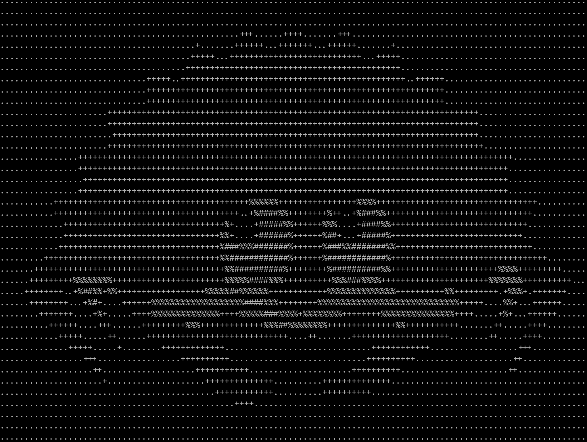

# Image to ascii

Simple image to ascii converter in Rust.

## Usage:

```
image-to-ascii [OPTIONS] --image <IMAGE>

Options:
-i, --image <IMAGE>
-x, --width <WIDTH> [default: 80]
-y, --height <HEIGHT> [default: 80]
-h, --help Print help
-V, --version Print version
```

## Example

`cargo run -- --image img.png -x 120 -y 40`



